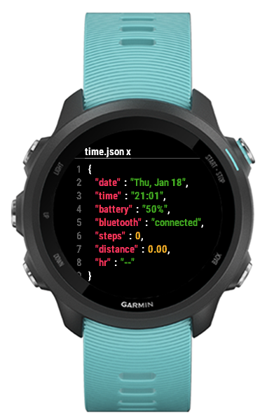

# Garmin Forerunner Watch Face time.json

Fully working watch face for Garmin device in Monkey C for Garmin SDK.

Please ask for your model. I will try to support it!

Tested and available for:

- Epix Pro 2 (51 mm).
- Forerunner 245/255/745/945/955.
- Venu 3.
- Vivoactive 4/4S/5.

Disclaimer: Due to some constraints about the face size and the minimum font size supported vivoactive devices will not show bluetooth information. PR are welcome!

[Connect IQ Store page](https://apps.garmin.com/es-ES/apps/cf49a195-e5a9-48de-af23-83b21f9a4294)

## Features

- 📅 Date (Week day/Month)
- 🕚 Time (Hours/Minutes)
- 🔋 Battery
- 📱 Bluetooth Connectivity Status
- 🚶🏽‍♂️ Step Count
- 📏 Distance in km
- 💗 Heart Rate

---

## Credits

- [FitbitClock Face inspiration](https://www.reddit.com/r/ProgrammerHumor/comments/196ctut/thisfitbitclockface/)

## Author and License

[Juan Aguilar](LICENSE)
